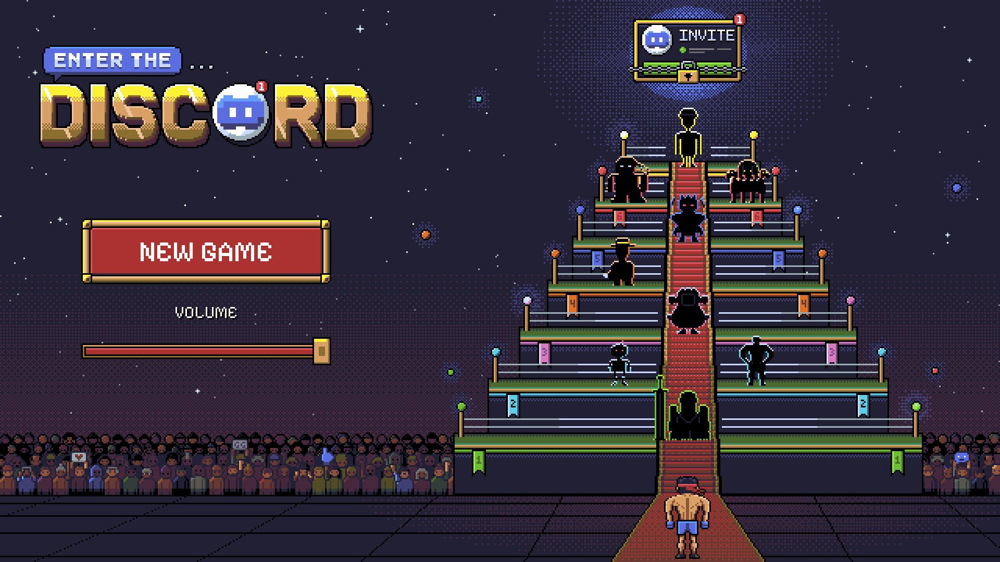
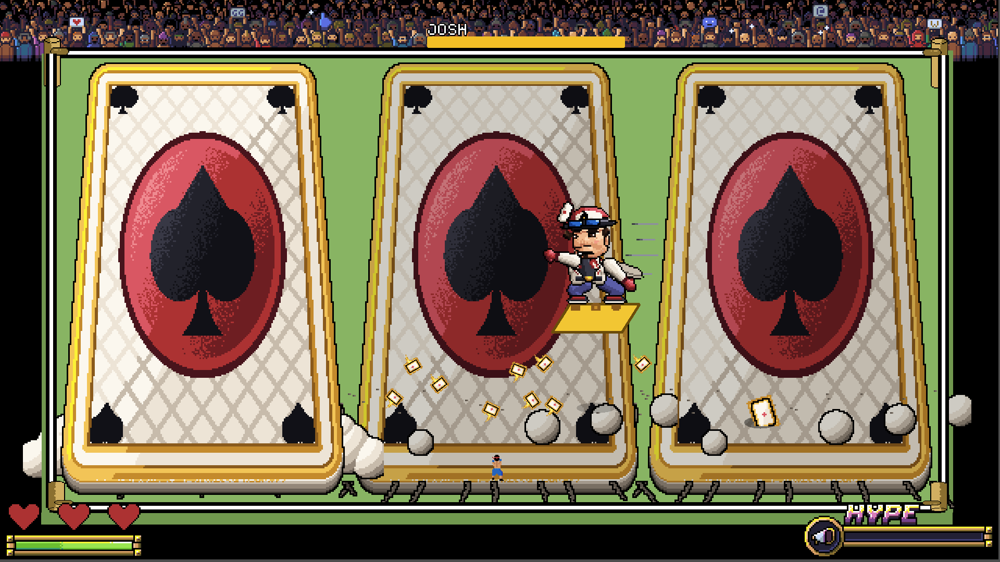
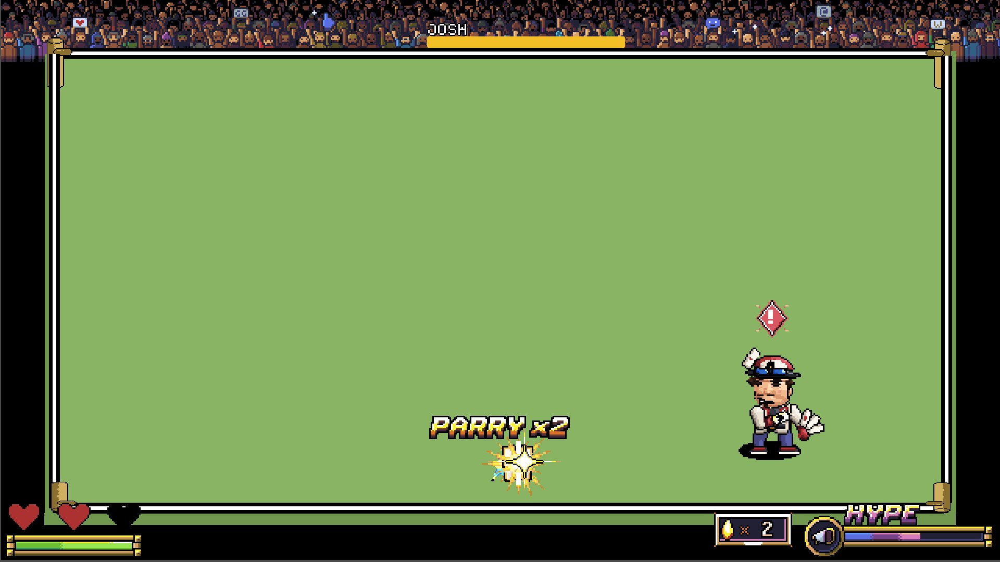

# Project FMWO

A pixel-art boss rush. You are BURAK, a newcomer trying to earn an invite to a Discord server, and the only way in is to fight your way through its members one at a time in a wrestling ring while the server watches from the crowd.



Made in Godot 4.6. Every sprite, effect, screen and sound in the repo is generated from scratch — there are no downloaded assets.

## Requirements

- **Godot 4.6.3** (standard build, not .NET), using the **Forward+** renderer. Older 4.x versions will open the project but are not tested.
- Nothing else. The one addon the game uses, [Dialogue Manager](https://github.com/nathanhoad/godot_dialogue_manager), is committed in `addons/`, so a fresh clone runs as-is.

## Install and run

```bash
git clone https://github.com/yilmazbur14/project-fmwo.git
```

1. Open the Godot project manager, choose **Import**, and select `project.godot` in the cloned folder.
2. Open the project. The first import takes a minute or two while Godot builds its texture cache — that is normal and only happens once.
3. Press **F5** (Run Project) or the play button. It starts on the main menu.

If the editor complains about the Dialogue Manager plugin on first open, enable it under **Project → Project Settings → Plugins** and reload the project.

## Controls

| Action | Key |
|---|---|
| Move | Arrow keys |
| Punch | **Q** |
| Dash | **W** |
| Block / Parry | **Shift** |
| Advance dialogue | **Space** |
| Finisher (when a boss is dazed) | Mash **Q** and **W** alternately |

The game teaches these on its controls screen at the start of a new run, and Danny walks you through them in the tutorial dialogue.

## How to play

From the menu, **NEW GAME** runs the intro cutscene, then the controls screen, then the first fight and onward through the ladder. Rank up after each win — member, regular, veteran, trusted, moderator, admin — and the invite is waiting at the top.

There is also a **BOSS SELECT (PLAYTEST)** panel on the menu that jumps straight into any fight. It is a development aid, not part of the game: set `SHOW_BOSS_SELECT` to `false` at the top of `Scripts/MainMenuScript.gd` to remove it entirely.



### Fighting

Bosses are not damaged by attacking them whenever you like. Each one cycles through its attacks and then leaves a **recovery window** — that is when you hit it.

- **The combo has timing.** Three punches, but mashing Q as fast as possible drops it. Land each punch as the previous one connects and the third is a charged hit.
- **Blocking costs stamina** and is directional — you absorb what you are facing. Run out of stamina and your guard breaks, leaving you rooted and open.
- **A parry is a fresh Shift press just as an attack lands.** It costs no stamina, negates the hit, and on some attacks staggers the boss into an extra punch window. Consecutive parries build a streak that pays escalating crowd hype.
- **A dash through an attack at the last moment is a perfect dodge**, which refunds the dash's stamina. Dashing has recovery frames afterwards, so it cannot be spammed — but a successful parry cancels them.
- **Crowd hype** builds as you fight well. At full hype your finisher is supercharged.
- **The finisher:** land a full combo and the boss is dazed. Mash Q and W alternately to charge, and you launch an uppercut that ends its recovery early — devastating at full hype.



## The bosses

| # | Boss | What makes them different |
|---|---|---|
| 1 | **Eric** | A white knight with a greatsword. Throws it, quakes the ring, and has a command grab you can parry. |
| 2 | **Greyson & Computah** | A laser duo that morphs into a mech at half health — rockets, beams and a ground pound. |
| 3 | **Mason** | Fights from his couch. Bomb lines, a chicken nugget meteor shower, and he calls in a friend to elbow drop you. |
| 4 | **Josh** | A card sharp who rides a giant playing card, drops card bombs, and plays three-card monte with your controls. |
| 5 | **Carter** | *In progress.* Locks you in a spotlight and sends clones at you — parry the red ones, never the yellow ones. |
| 6 | **Liam & Bixby** | Carried in on a throne, until his dog swallows him and becomes a three-headed flying demon. |
| 7 | **Jordan** | The final boss. Summons collectible figures that chase you and explode. |

Carter's fight is still being built, so the ladder currently skips his slot and runs Eric → Greyson → Mason → Josh → Liam → Jordan. His entry in the boss select is greyed out until the fight exists.

## What is and isn't finished

- **Done:** all six playable fights end to end, the full defence and finisher systems, the menu, victory, defeat, controls and cutscene screens, the crowd, per-character dialogue voices, and the art for everything above.
- **Placeholder:** most music (one shared boss theme), and some sound effects. The outro dialogue for several bosses is written but rough.
- **Not built yet:** Carter's fight, Jordan's later phases, and a save system — progress lives in memory for the length of a run.

## Repository layout

| Path | What's in it |
|---|---|
| `Scenes/` | Every scene: `Bosses/` per fight, `Core/` for the arena and screens, `Player/` |
| `Scripts/` | Game code. Each boss has a body script plus a state machine under `Scripts/States/<Boss>/` |
| `Assets/` | The finished art, audio and UI |
| `Dialogue/` | Dialogue Manager scripts for every fight |
| `art_source/` | The Python generators that produce the art, kept out of Godot with `.gdignore` |

Two conventions worth knowing before changing anything:

- **Art is generated, not hand-drawn in an editor.** Each sprite has a Python generator in `art_source/` and a matching `.aseprite` beside the PNG that must export identically. Regenerate rather than editing pixels in place.
- **Gameplay timing must survive the finisher's time-stop.** Use `Timer` nodes, `_physics_process` accumulators or node-bound tweens — never `get_tree().create_timer()` or a tree-level `create_tween()`, both of which keep running while the fight is frozen.

## Credits

Game and direction by [@yilmazbur14](https://github.com/yilmazbur14). Built with [Godot](https://godotengine.org/) and [Dialogue Manager](https://github.com/nathanhoad/godot_dialogue_manager). The bosses are affectionate caricatures of real people, used with the warmth they deserve.
